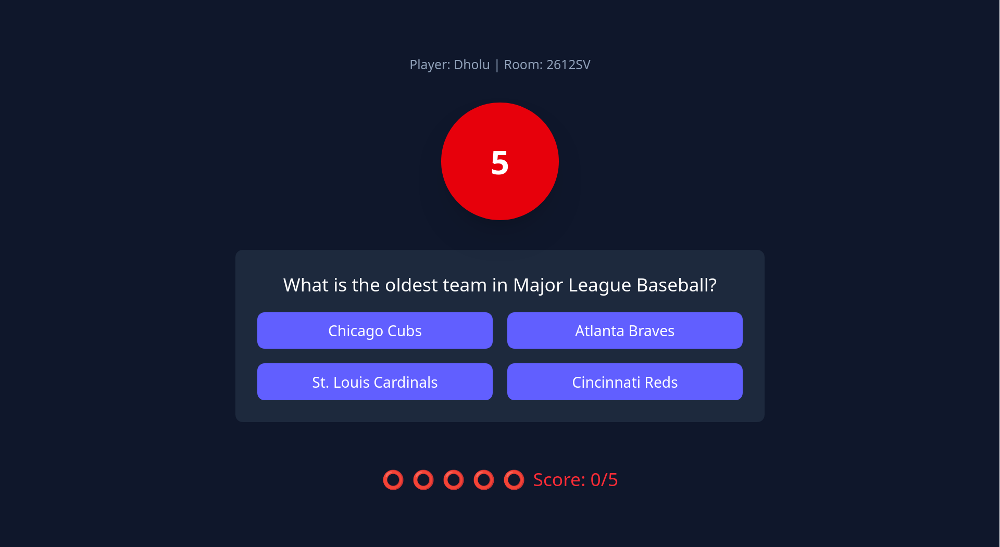

# Quizar

Quizar is a real-time multiplayer quiz game built with React, Node.js, Express, and Socket.IO. Players can create or join quiz rooms, compete in answering questions, and see live rankings at the end of each game.

[play the game here](https://quizar-ten.vercel.app/)

[backend here](https://quizar.onrender.com)

---

## Features

- Real-time multiplayer quiz rooms
- Room creation and joining with unique codes
- Live player list and admin controls
- Timed questions with automatic progression
- Live score and ranking display at game end

---

## Screenshots

<!-- Add your images below -->





---

## Getting Started

### Prerequisites

- Node.js (v18+ recommended)
- npm or yarn

### Installation

1. **Clone the repository:**
   ```bash
   git clone https://github.com/yourusername/Quizar.git
   cd Quizar
2. **Install backend dependencies:**
    ```bash
    cd backend
    npm install
3. **Install frontend dependencies:**
    ```bash
    cd ../frontend
    npm install
4. **Set up env variables**

    create ./backend/.env -> ```PORT=8080```
    ```FRONTEND_URL=http://localhost:5173```

    create ./frontend/.env -> ```VITE_BACKEND_SERVER=http://localhost:8080```

### Running the App

*Start backend Server*
    ```bash
    cd backend
    npm run dev

*Start Frontend*
    ```bash
    cd frontend
    npm run dev

### Project Structure

```
Quizar/
├── backend/
│   ├── index.js
│   └── ...other backend files
├── frontend/
│   ├── src/
│   │   ├── pages/
│   │   ├── sockets/
│   │   └── App.jsx
│   └── ...other frontend files  
└── [README.md]
```
### Technologies Used
 - React
 - Vite
 - Tailwind CSS
 - Node.js
 - Express
 - Socket.IO

 ### Acknowledgements 

    - Open Trivia DB for quiz questions
    - Socket.IO documentation is pretty nice
    - Tailwind pretty nice documentation
    - React 
    - ChatGPT for writing this readme
